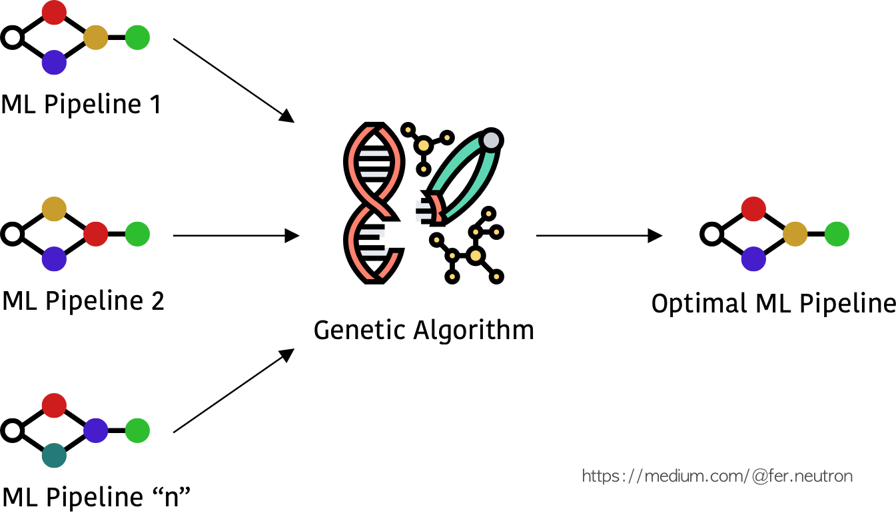

<!-- PROJECT SHIELDS -->
<!--
*** I'm using markdown "reference style" links for readability.
*** Reference links are enclosed in brackets [ ] instead of parentheses ( ).
*** See the bottom of this document for the declaration of the reference variables
*** for contributors-url, forks-url, etc. This is an optional, concise syntax you may use.
*** https://www.markdownguide.org/basic-syntax/#reference-style-links
-->
[![Medium][medium-shield]][medium-url]
[![Twitter][twitter-shield]][twitter-url]
[![Linkedin][linkedin-shield]][linkedin-url]

# TPOT: Pipelines Optimization with Genetic Algorithms
This repository contains an implementation of TPOT for obtaining optimal pipelines with the use of genetic algorithms.

If you want to know more about TPOT, how it works and what its components are, I really recommend you take a look at the blog: <a href="https://towardsdatascience.com/ensemble-learning-stacking-blending-voting-b37737c4f483"> TPOT: Pipelines Optimization with Genetic Algorithms</a>

<p align="center">

</p>

<!-- TABLE OF CONTENTS -->
## Table of Contents

* [Files](#files)
* [How to use](#how-to-use)
* [Contributing](#contributing)
* [Contact](#contact)
* [License](#license)

<!-- files -->
## 1. Files
* **main.py**: Contains the implementation of TPOT Classifier
* **optimal_pipeline.py**: Contains the optimal suggested pipeline obtained once TPOT Classifier has been implemented.


<!-- how-to-use -->
## 2. How to use
I recommend you to work with a virtual environment, in this case I am using pipenv. So in order to install the dependencies located in the ``Pipfile`` you just need to type:

```SH
pipenv install
```
and then

```SH
pipenv shell
```

For optimizing the pipeline with TPOT Classifier, first comment the following line in ``main.py`` :

```PY
if __name__ == "__main__":
    automl = AutoML()
    automl.load_data()
    automl.pipeline_optimization()
    # automl.train_suggested_tpot()
```

then run:

```SH
python -Bi main.py
```

once the optimization has been finalized, in the python console type the following:

```SH
automl.model.export('optimal_pipeline.py')
```

the previous command will overwrite the file ``optimal_pipeline.py``. Open the ``optimal_pipeline.py`` and copy the pipeline function, the one looks like this:

```PY
# Average CV score on the training set was: 0.9347254053136407
exported_pipeline = make_pipeline(
    PolynomialFeatures(degree=2, include_bias=False, interaction_only=False),
    VarianceThreshold(threshold=0.2),
    ZeroCount(),
    GradientBoostingClassifier(learning_rate=1.0, max_depth=10, max_features=0.9000000000000001, min_samples_leaf=16, min_samples_split=3, n_estimators=100, subsample=0.7000000000000001)
)
```

paste the previous function into the ``main.py`` file in the following function, such as:

```PY
def pipeline_suggested_by_tpot(self):
    # Copied from optimal pipeline suggested by tpot in file "optimal_pipeline.py"
    # Initialize 
    exported_pipeline = make_pipeline(
                    PolynomialFeatures(degree=2, include_bias=False, interaction_only=False),
                    VarianceThreshold(threshold=0.2),
                    ZeroCount(),
                    GradientBoostingClassifier(learning_rate=1.0, max_depth=10, max_features=0.9000000000000001, min_samples_leaf=16, min_samples_split=3, n_estimators=100, subsample=0.7000000000000001)
                    )
    # Init training
    exported_pipeline.fit(self.x_train, self.y_train)
    
    print(f"Train acc: {exported_pipeline.score(self.x_train, self.y_train)}")
    print(f"Test acc: {exported_pipeline.score(self.x_test, self.y_test)}")
```

Great, the last step is just run the ``main.py`` by commenting the following lines:

```PY
if __name__ == "__main__":
    automl = AutoML()
    automl.load_data()
    # automl.pipeline_optimization()
    automl.train_suggested_tpot()
```

that is it!

<!-- contributing -->
## 3. Contributing
Feel free to fork the model and add your own suggestiongs.

1. Fork the Project
2. Create your Feature Branch (`git checkout -b feature/YourGreatFeature`)
3. Commit your Changes (`git commit -m 'Add some YourGreatFeature'`)
4. Push to the Branch (`git push origin feature/YourGreatFeature`)
5. Open a Pull Request

<!-- contact -->
## 5. Contact
If you have any question, feel free to reach me out at:
* <a href="https://twitter.com/Fernando_LpzV">Twitter</a>
* <a href="https://medium.com/@fer.neutron">Medium</a>
* <a href="https://www.linkedin.com/in/fernando-lopezvelasco/">Linkedin</a>
* Email: fer.neutron@gmail.com

<!-- license -->
## 6. License
Distributed under the MIT License. See ``LICENSE.md`` for more information.


<!-- MARKDOWN LINKS & IMAGES -->
<!-- https://www.markdownguide.org/basic-syntax/#reference-style-links -->
[medium-shield]: https://img.shields.io/badge/medium-%2312100E.svg?&style=for-the-badge&logo=medium&logoColor=white
[medium-url]: https://medium.com/@fer.neutron
[twitter-shield]: https://img.shields.io/badge/twitter-%231DA1F2.svg?&style=for-the-badge&logo=twitter&logoColor=white
[twitter-url]: https://twitter.com/Fernando_LpzV
[linkedin-shield]: https://img.shields.io/badge/linkedin-%230077B5.svg?&style=for-the-badge&logo=linkedin&logoColor=white
[linkedin-url]: https://www.linkedin.com/in/fernando-lopezvelasco/